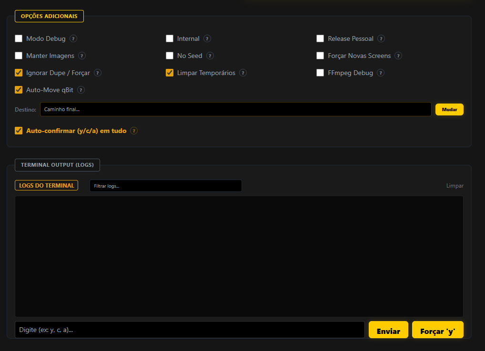
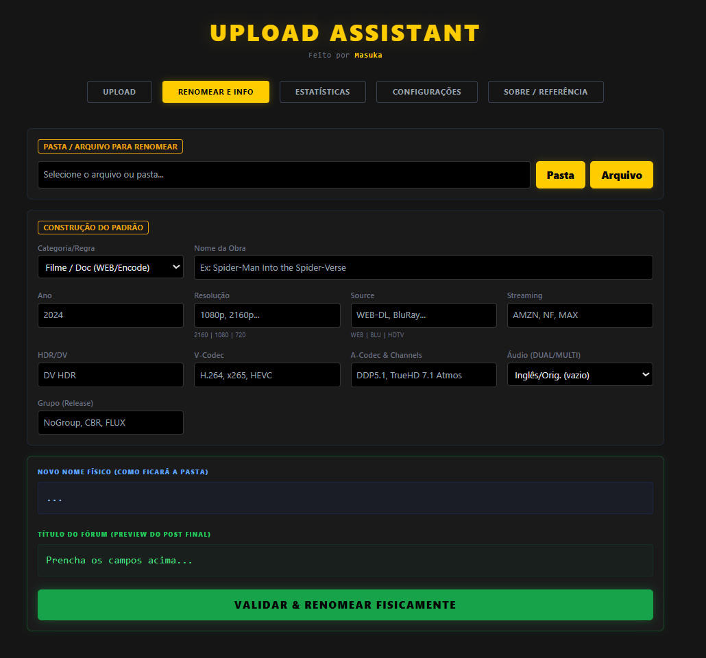

# Upload Assistant GUI

> **Aviso da Comunidade:** Eu sei que o desenvolvedor original do projeto (Audionut) está trabalhando no desenvolvimento de uma GUI oficial. Eu criei esta interface (usando Go + React) primeiramente para uso próprio, como uma prova de conceito para testar algumas ideias, mas o resultado final ficou tão bom prático que decidi abrir o repositório e compartilhar com a comunidade!

Uma interface gráfica limpa, moderna e leve desenvolvida para facilitar o processo de upload em Trackers Privados.

---

## Screenshots

| Aba Upload — Pré-visualização de Screenshots | Opções e Log de Progresso |
|:---:|:---:|
|  |  |

| Aba Renomear e Info |
|:---:|
|  | 

Este projeto atua como um frontend alternativo para o famoso script de linha de comando `Upload-Assistant`. Ele foca em tirar a fricção do dia a dia adicionando ferramentas como preenchimento automático, limpeza de nomes e alertas visuais, sem tirar o poder avançado da ferramenta original em Python.

---

## O que este projeto automatiza?

Meu foco é tirar o trabalho braçal e repetitivo do uploader através de dois módulos principais: a **Aba de Upload** e a **Aba de Renomenclatura (Renomear)**.

### 🚀 Aba de Upload (UP)
A central principal onde a automação para geração do torrent acontece:

* **Integração Automática (TMDB/IMDB):** O sistema lê sua mídia, limpa o título de "tags" pesadas e em milissegundos bate lá na API do TMDB voltando com o ID exato e os posters de capa.
* **Radar Inteligente:** A interface descobre sozinha se é um Filme ou Série, além da sua Resolução (1080p/2160p) e Fonte (WEB-DL/Remux) interpretando o prefixo da mídia baixada no seu HD.
* **Validação Anti-Erro (FFprobe):** Antes de gerar o torrent, a ferramenta analisa seu vídeo por dentro. Se você selecionou a option "DUAL", mas o vídeo só tem áudio em Português, o programa barra na tela. Evitando perdas de conta nos trackers.
* **Gestor de qBittorrent:** Configurou sua WebUI nos Ajustes? A interface interage com seu cliente de torrents e ao finalizar envia um "Move" da pasta Temp pra conta definitiva de "Seed".
* **Aprovação Automática:** O motor Python em linha de comando muitas vezes "trava" rodando um pedido de "yes/no/cancel". Minha interface segura essa trava pelas costas mandando um `y` automático e o processo flui intacto até o fim.
* **Galeria de Pré-Visualização:** Tire screenshots randômicas do vídeo direto na interface, jogue num lightbox (tela ampliada) e veja na hora se a cena não capturou letreiros e borrões. Caso ocorra, só apertar 'Gerar Novas' sem precisar encerrar o Upload inteiro.

### 📝 Aba Renomear (Mass Rename)
Sabe aquele arquivo "sujo" baixado de track público fora do padrão total? Esse módulo soluciona isso. Nele você pega nomes feios, confusos ou com separações esquisitas e "converte" pro formato perfeito da cena num piscar de olhos.

> ⚠️ **Aviso Importante sobre Padrões:** Atualmente, a regra de renomeação que atua no sistema de Clean Name sob a Aba Renomear, foi escrita para seguir **única e exclusivamente os padrões e exigências restritas do Tracker Capybara (CBR)**.

---

## Por que minha interface usa o [Go] e não [Python]?

É uma dúvida normal tentar colocar uma UI dentro da própria automação em Python. Mas preferimos essa estrutura:

| Motivo | Vantagem Prática na GUI (Go + React) |
|-------------|--------------------------------------------|
| **Velocidade e Memória** | Ela gasta algo em torno de ~25MB aberta, e pula na tela rápido sem o uso massivo que libs pesadas PyGTK e PyQt costumam consumir na inicialização do host. |
| **Não trava seu app** | O Go tem processos chamados `Goroutines` que deixam a interface respondendo lisa em uma thread e executando suas lógicas complexas do Tracker em outra. |
| **Interface Frontend Real** | Eu uso o pacote `Wails`, e com ele desenho telas com linguagens fáceis (HTML/CSS) sem precisar lidar com a complexidade de rodar um micro servidor (Django/Flask) no Desktop. |

**Muito Importante:** Toda a base, geração e envio nativo à API do Tracker **ainda pertence 100% ao ótimo motor em python original do [Audionut](https://github.com/Audionut/Upload-Assistant)**. Eu apenas criei um balcão mais amigável para ele!

---

## 🔒 Regras de Segurança (Sem `.exe`)

**Eu não gero e você não deve baixar instaladores `.exe` em nenhum lugar!** 

Segurança em indexadores de Trackers Privados são prioridade número 1. O jeito mais prudente de atuar é rodando essa GUI **toda pelo código aberto**.

Dessa forma, eu garanto que:
1. Você não caia no risco de baixar compilações (.exe, .msi, etc.) contendo malwares focados no furto dos seus cookies e chave Passkey. 
2. Acessa as linhas com fácil visualização a tudo que a minha aplicação manda, ou extrai pra te proteger.

> Se por acaso for surpreendido com membros passando o executável fechado do projeto sob pretexto de facilidade, não baixe. Faça os 3 comandos simples abaixo da Iniciação e rode seguro no seu próprio PC.

---

## ⚙️ Instalação Expresso

O preparo envolve duas pontas do projeto: ferramentas base da engenharia original, e pacotes da GUI .

### 1- Configurando Automações Nativas (Path)
As 2 aplicações abaixo precisam estar listadas globais nas variáveis de ambiente `PATH` no Windows.

* **Upload-Assistant:** Obtenha um clone nativo direto do repositório final pela [Página do Audionut](https://github.com/Audionut/Upload-Assistant). Abra no terminal, e preencha dependência (`pip install -r requirements.txt`). O preenchimento da `data/config.py` é essencial para operar.
* **FFmpeg:** Você precisa usar FFmpeg oficial para a verificação das imagens e vídeos ([baixe binários em pastas do GyanD](https://github.com/GyanD/codexffmpeg/releases/tag/2023-01-26-git-cf9e38d726)). Extraia todo conteúdo na sua máquina e ligue ele nas Variáveis Globais para podermos ativá-lo por CMD.

### 2- Ecossistema Front-End e Go-Lang (Run!)
Com base de Trackers resolvidas, foque-se nesta UI.
- Use a Linguagem Compilada: **[Golang](https://go.dev/dl/)**.
- Suporte visual JavaScript: **[Node.JS (LTS)](https://nodejs.org/en/)**.
- Uma rápida ativação do motor gráfico [Wails CLI] pelo Console:
   ```bash
   go install github.com/wailsapp/wails/v2/cmd/wails@latest
   ```

Dentro de terminal referenciado **nesta pasta GUI**, de sua chamada principal:
```bash
wails dev
```
O console mostrará rapidamente o compilado e a aba será acionada na tela na mesma hora em modo Dev c/ live reload. Fechar a tela interrompe os serviços com tranquilidade.


